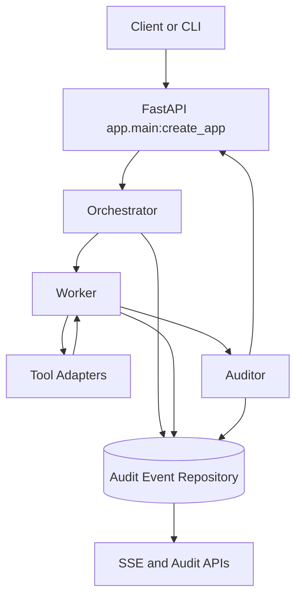

# TRIADA Architecture

TRIADA is an MVP control loop for delegated DevOps work. It separates planning,
execution, and verification into explicit roles and records public, redacted
evidence in an append-only audit stream.

## Roles

- Orchestrator turns a goal into a bounded plan with allowed tools and
  acceptance criteria.
- Worker executes approved steps through tool adapters and emits progress,
  heartbeat, artifact, and tool-result evidence.
- Auditor compares claims with tool results and required artifacts, then returns
  `pass`, `corrections_required`, `blocked`, or `fail`.

## Control Boundaries

- API boundary: FastAPI routes validate task requests and expose task control,
  audit, artifact, and SSE read models.
- LLM boundary: providers are behind `app.llm.base`; local development uses
  `FakeLLMProvider`.
- Tool boundary: adapters implement `validate_input`, `dry_run`, `execute`,
  `validate_result`, and `rollback`.
- Persistence boundary: `AuditEventRepository` appends ordered trace events and
  verifies the hash chain.
- Reasoning data boundary: public progress is exposed through
  `thinking_summary_delta`; raw model reasoning, when captured, is treated as
  sensitive audit data and is not part of public read models by default.

## Storage

The default database is SQLite through `sqlite+aiosqlite:///./triada.db`.
Docker Compose uses PostgreSQL through `postgresql+asyncpg://...`.
