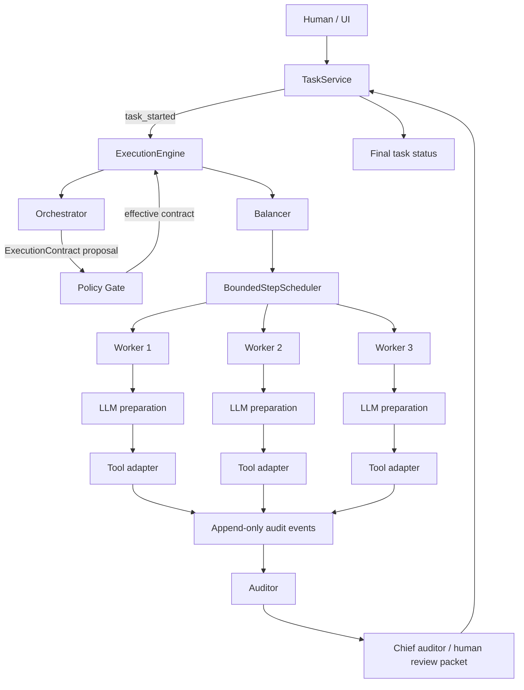
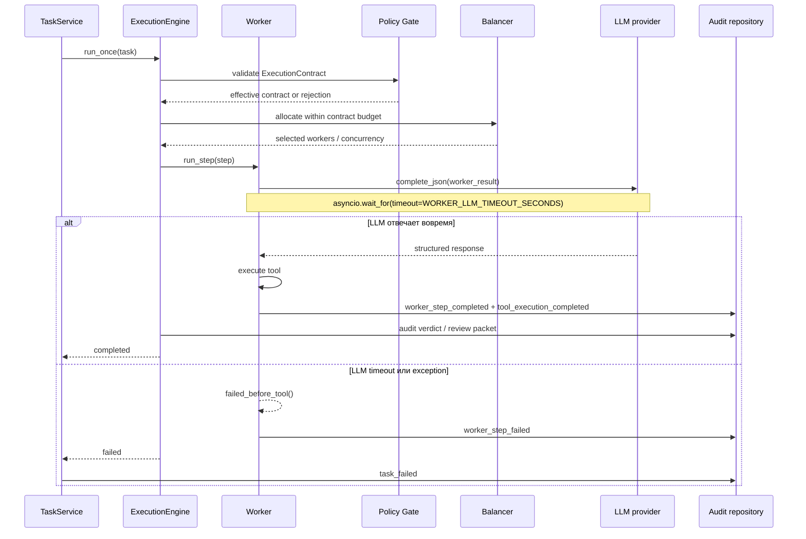
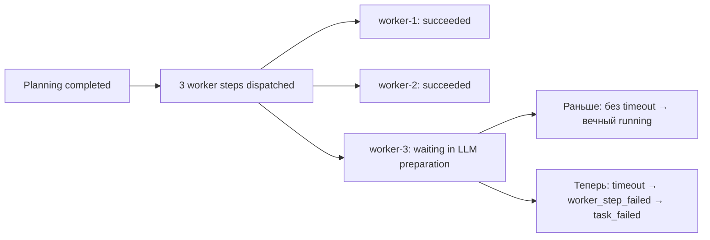

# TRIADA runtime flow

## Основной поток

Балансировщик теперь получает `resource_budget` из effective
`ExecutionContract`. Системный `SwarmContract` по-прежнему задаёт верхние
границы пар и concurrency; контракт Orchestrator может только сузить работу в
этих границах.

## Research run completion

Для целей, которые Orchestrator распознаёт как research/analysis, создаётся
`ResearchContract`. В нём фиксируются вопросы, глубина, минимальное количество
tool evidence, обязательные артефакты и схема отчёта. `CompletionGate` проверяет
этот контракт после Worker и Auditor. Поэтому успешная команда вроде `git
status` сама по себе больше не может завершить архитектурное исследование:
без `research_report` и достаточного evidence run получает
`completion_gate_failed` и статус `failed`.

LLM boundaries имеют отдельные таймеры:

- `ORCHESTRATOR_LLM_TIMEOUT_SECONDS` — planning;
- `WORKER_LLM_TIMEOUT_SECONDS` — подготовка worker step;
- `AUDITOR_LLM_TIMEOUT_SECONDS` — review evidence.

OpenAI-compatible SSE responses дополнительно ограничены абсолютным 30-секундным
stream deadline. Это важно потому, что transport read timeout ограничивает паузу
между chunks, но не общий lifetime потока, который может бесконечно присылать
частичные deltas. Deadline применяется и к ожиданию первого/следующего chunk,
поэтому silent upstream тоже завершается.

Если клиентский запрос `run_once` отменяется до завершения execution,
`TaskService` перехватывает cancellation и добавляет `task_cancelled` с причиной
`execution_cancelled`, чтобы persisted task не оставался в `running`.

Timeout planning публикует `llm_unavailable` и завершает задачу как `blocked`.
Timeout auditor публикует `audit_failed`, формирует FAIL verdict и завершает
задачу как `failed`. Ни один из этих случаев не должен оставлять task в
`running`.

Поверх компонентных таймеров `TaskService` имеет общий
`TASK_EXECUTION_TIMEOUT_SECONDS` (по умолчанию 300 секунд). Он оборачивает весь
`run_once`; если зависнет сетевой клиент или другой участок execution flow,
публикуется `task_timeout`, а задача переходит в `timed_out`.

При старте процесса `TaskService` также закрывает persisted-задачи, оставшиеся
в `running` после перезапуска API: они переходят в `timed_out`, в metadata
фиксируется `recovery.reason=process_restart`, а в append-only trail добавляется
`task_recovered`. Это предотвращает вечные orphaned-записи в Observatory UI.

Каждый worker сначала получает публичную модельную подготовку шага, затем
запускает allowlisted tool. Orchestrator не выполняет инструменты напрямую,
Auditor не меняет исходные audit events.

## Защищённый поток при зависшем LLM

## Что происходило в задаче `dd654c78-df89-435a-8897-bc167345d84b`

## Настройка

`WORKER_LLM_TIMEOUT_SECONDS` задаёт максимальное время ожидания подготовки
worker-моделью. Значение по умолчанию — 60 секунд. Таймер применяется только
к вызову LLM worker’а; timeout инструментов остаётся отдельной границей
`ShellTool`/`GitTool`.
