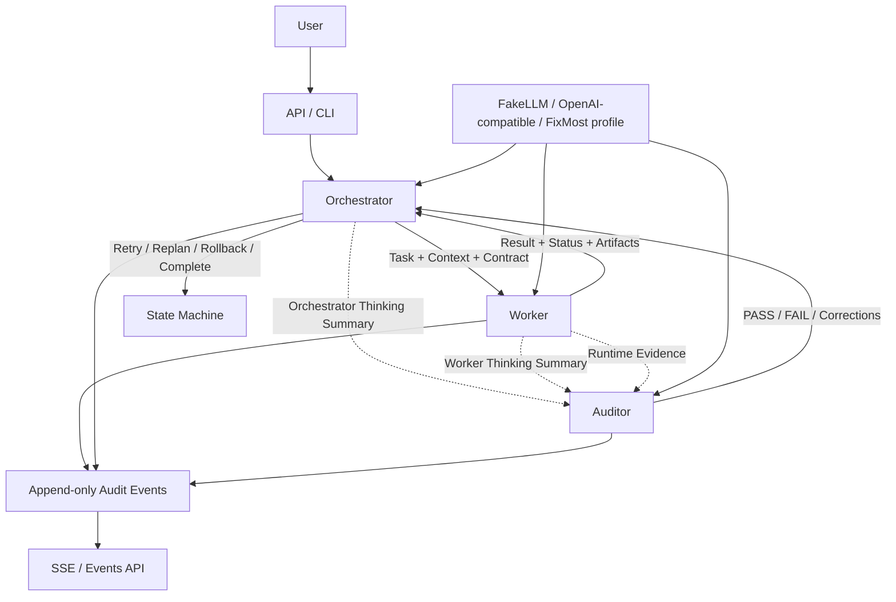

# DevOps Multiagent Framework Design

## Context

The current repository is a small FixMost / `corp-coder` delegation toolkit. The new project will turn it into a locally runnable, production-oriented Python framework for long-running DevOps tasks. The framework must be independent from Codex at runtime. Codex and the existing FixMost helper can be used during development, but the application itself must run as a standalone service and CLI.

The system follows the triad shown in the supplied architecture sketch:

- Orchestrator manages planning, state, retries, rollback decisions, and completion.
- Worker executes one scoped task and reports evidence.
- Auditor observes and validates plans, runtime facts, artifacts, and results.

The selected MVP approach is **Core Framework First**. The first pass builds durable contracts, persistence, auditability, provider routing, API/SSE, CLI, demos, and safety tests. Deep DevOps tool automation is intentionally kept safe, minimal, read-only, or dry-run oriented in this phase.

## Goals

- Build a Python 3.12 FastAPI application with SQLAlchemy 2.x, Alembic, asyncio, httpx, pytest, and pytest-asyncio.
- Support PostgreSQL for local Docker Compose/runtime and SQLite for tests.
- Support `FakeLLMProvider` for deterministic tests.
- Support `OpenAICompatibleProvider` for local OpenAI-compatible endpoints and a FixMost / `corp-coder` profile.
- Persist all runtime evidence as append-only audit events before publishing to API/SSE consumers.
- Implement strict `thinking_summary_delta` telemetry without capturing or storing hidden chain-of-thought.
- Redact secrets before events, deltas, exceptions, logs, and API responses are persisted or returned.
- Support long-running task mechanics: lease, heartbeat, checkpoint, progress, timeout, cancellation, retry, resume, and accelerated fake-clock simulation.
- Provide a local API, CLI, demo scenarios, documentation, and tests that verify core safety properties.

## Non-Goals For MVP

- Full production Kubernetes, Terraform, Docker, or cloud remediation.
- Dangerous write operations without explicit approval and rollback metadata.
- Redis Streams as a required runtime dependency.
- Capturing hidden model chain-of-thought.
- Treating `thinking_summary_delta` or reasoning summaries as proof that work was performed.
- Replacing the existing FixMost helper unless later implementation makes that small CLI obsolete.

## Architecture

The first implementation creates the requested package layout under `app/`:

```text
app/
  api/
  agents/
    orchestrator.py
    worker.py
    auditor.py
  llm/
    base.py
    fake.py
    openai_compatible.py
  audit/
    emitter.py
    repository.py
    validator.py
    projection.py
    redaction.py
  events/
    bus.py
    models.py
  tools/
    shell.py
    filesystem.py
    kubernetes.py
    terraform.py
    docker.py
    git.py
  persistence/
    models.py
    session.py
  services/
    task_service.py
    heartbeat.py
    execution_supervisor.py
  schemas/
  cli.py
  main.py
```

### Runtime Flow

1. User submits a task through API or CLI.
2. `TaskService` creates a task and initial audit events.
3. `Orchestrator` classifies risk, builds a plan, creates step contracts, and emits runtime `thinking_summary_delta`.
4. `Worker` receives one ready step with scoped context and allowed tools only.
5. Tools execute through adapters. Each command/action creates persisted evidence events.
6. Worker returns status, artifacts, evidence, validation results, commands, errors, and recommendation.
7. Orchestrator sends the full persisted trace to `Auditor`.
8. Auditor validates facts and produces a verdict.
9. Orchestrator decides to complete, retry, replan, rollback, block, fail, or escalate.
10. API and SSE expose state and trace from persisted events.

### Mermaid Diagram



## Events And Persistence

`audit_events` is the source of truth. Every event is appended and persisted before publication. SSE, event APIs, auditor input, and trace verification read from persisted storage, not in-memory state.

Minimum persisted entities:

- `tasks`: goal, state, risk, constraints, allowed tools, acceptance criteria, timeout, retry limits.
- `task_steps`: planned steps, dependencies, input/output contracts, timeout, state.
- `agent_runs`: orchestrator, worker, and auditor lifecycle, state, heartbeat, lease metadata.
- `audit_events`: append-only source of truth with payload, sequence, `previous_hash`, and `event_hash`.
- `thinking_summary_deltas`: validated telemetry projection linked to trace/task/agent/span.
- `reasoning_summaries`: optional provider-returned summaries stored separately from deltas.
- `tool_executions`: command/action facts, exit code, stdout/stderr refs, timeout, timestamps.
- `artifacts`: generated files or structured outputs.
- `validation_results`: validation checks and outcomes.
- `audit_verdicts`: auditor decisions and violations.
- `task_checkpoints`: resume and long-running checkpoint records.

### Hash Chain

Each audit event in a trace is hash-chained:

```text
event_hash = SHA256(canonical_event_json + previous_hash)
```

The validator checks sequence continuity, duplicate IDs, previous-hash linkage, and computed hash equality. Any invalid chain fails trace verification and produces an audit violation.

### Redis Streams

Redis Streams remain optional in MVP. The event bus interface can publish to in-memory/SSE consumers from the DB event stream. Adding Redis later must not change event schemas or persistence order.

## Thinking Summary Delta

`ThinkingSummaryDelta` is strict structured telemetry. It is not hidden reasoning and is never proof of work.

The model includes:

- `schema_version: Literal["1.0"]`
- `event_id`, `trace_id`, `task_id`, `span_id`, `parent_span_id`
- `agent_id`, `agent_role`, `source`
- `sequence`, `stage`, `action`, `summary`
- `observations`, `input_refs`, `output_refs`
- `next_step`, `progress_percent`, `confidence`, `created_at`, `metadata`

Validation rules:

- Extra fields are rejected.
- `summary` is at most 1000 characters.
- `observations` has at most 10 items.
- Each observation is at most 500 characters.
- `confidence` is between 0 and 1.
- `progress_percent` is between 0 and 100.
- Sequence strictly increases per `agent_id`.
- Secret patterns are rejected or redacted before persistence.
- System prompts, raw chain-of-thought, and unsafe phrases such as `let me think step by step`, `hidden reasoning`, or `internal chain of thought` are rejected.

Runtime deltas are created by framework code for state transitions such as planning start, worker dispatch, command completion, validation, retry scheduling, rollback start, and task completion.

Model deltas are accepted only through a structured envelope:

```json
{
  "thinking_summary_delta": {
    "stage": "validation",
    "action": "check_result",
    "summary": "A concise public-safe status update.",
    "observations": [],
    "next_step": "Continue",
    "confidence": 0.8
  },
  "answer": {}
}
```

They pass schema validation, redaction, unsafe reasoning detection, normalization, persistence, and projection.

## Agent Behavior

### Orchestrator

The orchestrator receives goal, current state, environment metadata, constraints, allowed tools, risk level, acceptance criteria, timeout, and maximum retries. It does not execute shell commands directly.

Responsibilities:

- Analyze the request.
- Classify risk.
- Build a plan.
- Split work into steps.
- Define input/output contracts.
- Dispatch ready steps to workers.
- Monitor progress and worker results.
- Submit trace to auditor.
- Process auditor verdict.
- Retry, replan, rollback, escalate, block, fail, cancel, or complete.

### Worker

A worker receives one concrete task step. It operates in a scoped execution context and uses only allowed tool adapters.

Responsibilities:

- Validate input contract.
- Emit progress, heartbeat, and public-safe thinking summaries.
- Execute allowed tools.
- Persist factual events for each tool action.
- Return result, status, artifacts, evidence, commands, validation results, errors, and recommended next action.
- Avoid global decisions that belong to the orchestrator.

### Auditor

The auditor observes orchestrator and worker events. It validates evidence against the plan and contracts.

Required MVP rules include:

- `SUMMARY_CONTRADICTS_TOOL_RESULT`
- `CLAIM_WITHOUT_EVIDENCE`
- `REQUIRED_ARTIFACT_MISSING`
- `REQUIRED_VALIDATION_MISSING`
- `TOOL_FAILURE_NOT_REPORTED`
- `STEP_STARTED_WITHOUT_TERMINAL_EVENT`
- `HEARTBEAT_TIMEOUT`
- `INVALID_EVENT_SEQUENCE`
- `DUPLICATE_EVENT`
- `UNAUTHORIZED_TOOL`
- `RISKY_ACTION_WITHOUT_APPROVAL`
- `SYNTHESIS_WITHOUT_WORKER_RESULT`
- `ROLLBACK_REQUIRED_BUT_MISSING`
- `SECRET_DETECTED_IN_EVENT`
- `DELTA_ACTION_NOT_SUPPORTED_BY_RUNTIME`
- `COMPLETION_CRITERIA_NOT_MET`

The auditor prioritizes evidence in this order: tool outputs, exit codes, validation results, artifacts, git diff, runtime events, worker result, reasoning summary, and then `thinking_summary_delta`.

## Tools And Risk Policy

Tools implement a common interface:

```python
class ToolAdapter(ABC):
    name: str

    async def validate_input(self, request): ...
    async def dry_run(self, request): ...
    async def execute(self, request): ...
    async def validate_result(self, result): ...
    async def rollback(self, context): ...
```

MVP adapters:

- `ShellTool`: allowlisted commands, timeout, no `shell=True`, process group cancellation, streaming/captured stdout/stderr, output size limits, redaction, working-directory isolation.
- `FileSystemTool`: read/list/write only inside configured workspace; write actions need risk metadata.
- `GitTool`: read-only status, diff, and log by default.
- `TerraformPlanTool`: `fmt`, `validate`, and `plan`; never `apply`.
- `KubernetesReadOnlyTool`: `kubectl get`, `describe`, and `logs`; no mutating verbs.
- `DockerTool`: `ps`, `images`, and `inspect`; no prune/delete.

Risk policies:

- `READ_ONLY`: allowed by default.
- `LOW_RISK_WRITE`: requires dry-run and validation plan.
- `HIGH_RISK_WRITE`: requires approval event.
- `DESTRUCTIVE`: requires approval event and rollback evidence.

Blocked dangerous actions include Terraform apply, kubectl delete, helm uninstall, Docker prune, firewall changes, IAM changes, production service restarts, secret changes, destructive SQL, force push, and file deletion.

## Long-Running Tasks

The framework must support tasks up to 3 hours without a single long LLM request.

MVP mechanics:

- Task lease acquisition and renewal.
- Agent heartbeat every 60 seconds.
- Progress events for measurable progress changes.
- `thinking_summary_delta` at stage start, significant action completion, error, retry, rollback, blocked transition, substantial progress change, and before completion.
- Periodic thinking summary checkpoint at least every 5 minutes while active.
- Checkpoint persistence for resume.
- Cancellation support.
- Timeout supervision.
- Retry with a new agent run.
- Resume from persisted checkpoint.
- Fake clock for tests where 1 test second can represent 10 virtual minutes.

If no heartbeat is observed for 3 minutes, auditor emits `HEARTBEAT_TIMEOUT`, orchestrator checks worker state, and the task moves to stalled, retry, resume, or escalation.

If the 3-hour timeout is reached, execution supervisor publishes timeout, worker receives cancellation, auditor validates partial results, and orchestrator decides retry, replan, rollback, or escalate.

## API And SSE

MVP API endpoints:

- `POST /v1/tasks`
- `GET /v1/tasks/{task_id}`
- `POST /v1/tasks/{task_id}/cancel`
- `POST /v1/tasks/{task_id}/approve`
- `POST /v1/tasks/{task_id}/resume`
- `GET /v1/tasks/{task_id}/events`
- `GET /v1/tasks/{task_id}/thinking-summary`
- `GET /v1/tasks/{task_id}/audit`
- `GET /v1/tasks/{task_id}/artifacts`
- `GET /v1/tasks/{task_id}/stream`

SSE emits persisted events including:

- `task_state_changed`
- `thinking_summary_delta`
- `progress_update`
- `agent_heartbeat`
- `tool_execution_started`
- `tool_execution_completed`
- `worker_result`
- `audit_verdict`
- `task_completed`
- `task_failed`

`Last-Event-ID` restores the stream from persisted events after the supplied event ID.

## CLI

MVP CLI commands:

- `python -m app.cli demo`
- `python -m app.cli run-task task.json`
- `python -m app.cli verify-trace TRACE_ID`
- `python -m app.cli list-events TRACE_ID`
- `python -m app.cli simulate-long-task`
- `python -m app.cli test-provider`

`simulate-long-task` prints heartbeat, progress, thinking summary deltas, auditor checkpoints, and final timeout or completion.

## LLM Provider Routing

Provider selection comes from environment variables:

- `LLM_PROVIDER=fake|openai-compatible`
- `LLM_BASE_URL=`
- `LLM_API_KEY=`
- `LLM_MODEL=`
- `CAPTURE_REASONING_SUMMARY=true`
- `PASS_REASONING_SUMMARY_TO_AUDITOR=true`

`FakeLLMProvider` is deterministic and used by unit/integration tests.

`OpenAICompatibleProvider` uses `httpx` and supports local endpoints such as Ollama, vLLM, LM Studio, and remote OpenAI-compatible endpoints. A FixMost / `corp-coder` profile is supported by setting base URL, API key, and model. API keys are never logged, persisted, returned, or included in error messages.

## Documentation

MVP documentation files:

- `README.md`
- `ARCHITECTURE.md`
- `SECURITY.md`
- `AUDIT_MODEL.md`
- `EVENT_SCHEMA.md`
- `LONG_RUNNING_TASKS.md`
- `DEVOPS_TOOLS.md`
- `AGENTS.md`
- `.env.example`
- `docker-compose.yml`

`ARCHITECTURE.md` contains the Mermaid triad diagram and clearly states that the auditor observes and verifies, while the orchestrator makes control decisions.

## Testing And Validation

Required MVP tests cover:

- Orchestrator creates a plan.
- Worker receives only one task step.
- Worker returns evidence.
- Auditor accepts a correct trace.
- Auditor rejects unsupported or false summaries.
- Auditor detects non-zero exit codes.
- Auditor detects missing artifacts.
- Auditor detects missed heartbeat.
- Delta sequence strictly increases.
- Duplicate event is rejected.
- Hash chain is validated.
- API keys and secrets are redacted.
- SSE emits events before task completion.
- `Last-Event-ID` restores stream.
- Three-hour task is simulated with accelerated fake clock.
- Thinking delta is emitted during long task.
- Auditor receives deltas.
- Auditor does not treat deltas as proof.
- Timeout triggers cancellation.
- Retry creates a new agent run.
- Rollback requires evidence.
- High-risk actions require approval.
- FakeLLM is deterministic.
- Real provider is disabled in unit tests.

Validation commands:

```bash
python -m compileall app
pytest -q
alembic upgrade head
python -m app.cli demo
python -m app.cli simulate-long-task
```

## Acceptance Criteria

The MVP is ready when:

- The FastAPI app starts locally.
- Alembic migrations apply.
- API endpoints respond.
- CLI demo runs.
- Long-running simulation runs without real 3-hour waits.
- SSE emits deltas and supports restore.
- Auditor receives and evaluates thinking deltas.
- Auditor compares deltas to runtime evidence and rejects unsupported claims.
- Secret values do not appear in events, logs, exceptions, deltas, or responses.
- Trace hash-chain verification passes.
- `pytest -q` and `python -m compileall app` pass.

## Known Tradeoffs

- Redis Streams is optional in MVP; persisted DB events are the durable source and SSE restore mechanism.
- DevOps adapters are intentionally conservative. Read-only and dry-run behavior comes before write automation.
- FixMost / `corp-coder` is supported as an OpenAI-compatible provider profile or development delegation helper, not as a mandatory runtime dependency.
- The existing repository is not currently a git repository, so design and implementation commits cannot be made unless git is initialized or the work is moved into a git checkout.
